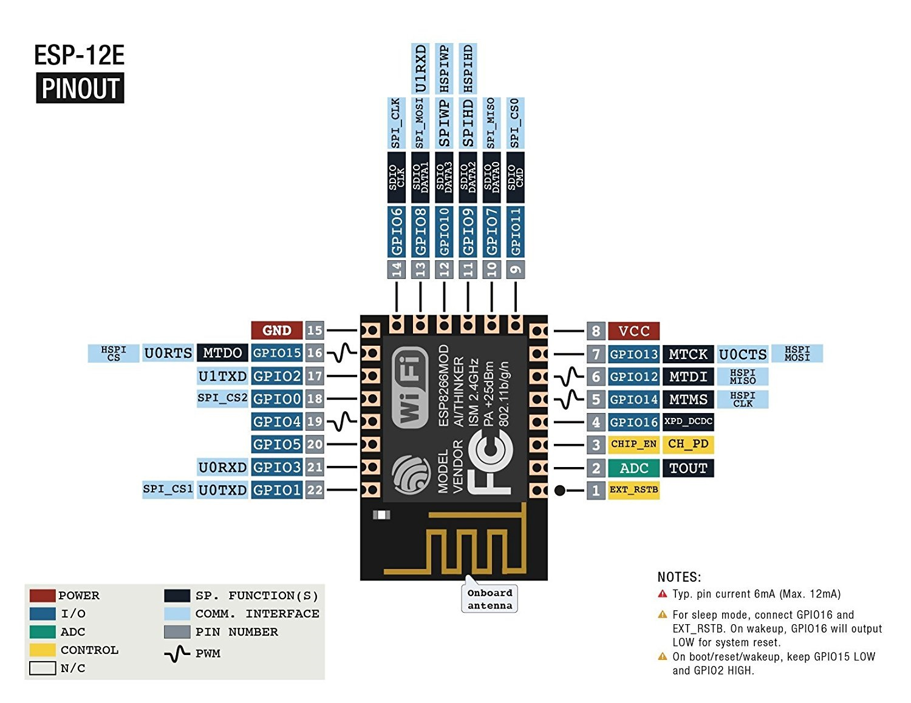

# cube_smart_home
graduation project for communication and electronics department fayoum university:\
## main project stages 
- [x] 1-Investigation . :shipit:  (over one month) 
- [ ] 2-Methodology Of Implementation.
- [ ] 3-Gain Knowledge.
- [ ] 4-Simulation & Testing.

## project block diagram 

## project main parts 
> as we saw in last fig there's main four parts \
1-nodes 'esp8266-12E'and its connected senors \
2-communication protocol connect nodes to main server (MQTT)\
3-local server that connect all nodes to each other (MQTT broker) and tranfer,save data \
/*
Using an MQTT server such as Mosquitto is very important because it allows
you to communicate machine to machine M2M
*/ \
4-mobile app end user interface  \

## sensors used in nodes 
01-humidity + temp (dht11)-------------------------------> sara to 29-1 -done \
02-pir(motion detection)---------------------------------> sara to 29-1 -done  \
03-relay (controles high voltage devices )--------------->keroles -done\
04-face detection security ------------------------------>keroles -done\
05-door locker with password and dynamic swithches------->mahmoud to 29-1 -done\
06-google assistant.-------------------------------------> \
07-plant sensors.----------------------------------------> \
08-smart bulb conected to the network--------------------> \
09-air quality control.mq135----------------------------->mahmoud to 29-1 -done\
10-we can use every node as wifi repeter ----------------> \
11-rfid ------------------------------------------------->

## security
we will use mqtt communication protocole with QOC3
# electroincs (from schematic to pcp )
## all with esp 8266 12E

two types of circuits .\
## A - work directly from electricty (220v).\
01-have relay .\
02-protectetion supply to esp (from 220v ac to 3.5v dc )or use battrey for power suplly(up to you ) .\
03-energy meter .\
03-decoding and safty circuit .
## B -work with varity of sensors 
01-battery with (Charging Protection + Discharge Protection) \
02-multiplexing circuit for switching between sensors  

## every node will may have 
01-TFT SPI LCD Display. \
02-all systems will be on board .\
03-run with battery and have safety circuit. \  
04-over the air (OTA) programing.\
05-sim module for internet connection in case of no internet.\
06-Charging Protection.\
07-Discharge Protection.\
08-
## general notes 
01- try use mqtt fx \
02-can we use smart nfc bear with main node \
