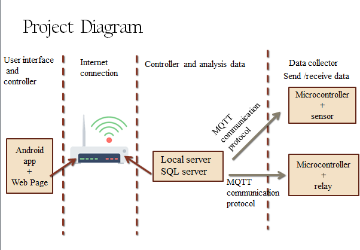

# cube_smart_home
graduation project for communication and electronics department fayoum university:\
## main project stages 
- [x] 1-Investigation . :shipit:  (over one month) 
- [ ] 2-Methodology Of Implementation.
- [ ] 3-Gain Knowledge.
- [ ] 4-Simulation & Testing.

## project block diagram 

## project main parts 
> as we saw in last fig there's main four parts \
1-nodes 'esp8266-12E'and its connected senors \
2-communication protocol connect nodes to main server (MQTT)\
3-local server that connect all nodes to each other (MQTT broker) and tranfer,save data \
4-mobile app end user interface  \

## sensors used in nodes 
1-humidity + temp.\
2-pir (motion detection)\
3-relay (controles high voltage devices )\
4-face detection security \
5-door locker with password\
6-google assistant.\
7-door lockers with dynamic swithches  \
8-plant sensors\
9-smart bulb conected to the network\

## security
we will use mqtt communication protocole with QOC3
